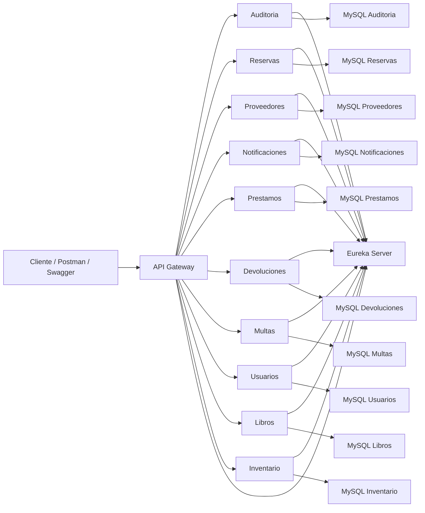

# Gestion de Bibliotecas

Proyecto transversal basado en una arquitectura de microservicios con Spring Boot, Spring Cloud Gateway, Eureka Server, MySQL, Docker, Railway, Swagger y JaCoCo.

El sistema permite administrar el ciclo principal de una biblioteca: usuarios, libros, inventario, reservas, prestamos, devoluciones, multas, proveedores, notificaciones y auditoria.

## Arquitectura



## Tecnologias

| Tecnologia | Uso |
|---|---|
| Java 21 | Lenguaje base de los microservicios |
| Spring Boot | Desarrollo de APIs REST |
| Spring Cloud Gateway | Entrada unica para consumir los microservicios |
| Netflix Eureka | Registro y descubrimiento de servicios |
| MySQL 8.4 | Base de datos por microservicio |
| Flyway | Migraciones de base de datos |
| Docker | Contenedores con imagenes basadas en Eclipse Temurin |
| Railway | Despliegue en la nube |
| Swagger / OpenAPI | Documentacion interactiva de endpoints |
| JaCoCo | Reporte de cobertura de pruebas |
| GitHub Actions | Construccion y publicacion de imagenes Docker en GHCR |

## Microservicios

| Servicio | Responsabilidad | Puerto local | Ruta principal |
|---|---:|---:|---|
| Eureka Server | Registro de microservicios | 8761 | `/` |
| API Gateway | Puerta de entrada y enrutamiento | 8081 | `/api/**` |
| Auditoria | Registra operaciones relevantes del sistema | 8080 | `/api/auditoria` |
| Reservas | Gestiona apartados de libros no disponibles | 8082 | `/api/reservas` |
| Proveedores | Administra proveedores de libros | 8083 | `/api/proveedor` |
| Notificaciones | Gestiona mensajes y avisos a usuarios | 8084 | `/api/notificaciones` |
| Prestamos | Registra prestamos de libros | 8085 | `/api/prestamos` |
| Devoluciones | Registra devoluciones de prestamos | 8086 | `/api/devoluciones` |
| Multas | Gestiona multas asociadas a atrasos o sanciones | 8087 | `/api/multas` |
| Usuarios | Administra usuarios del sistema | 8088 | `/api/usuarios` |
| Libros | Administra el catalogo de libros | 8089 | `/api/libros` |
| Inventario | Controla disponibilidad, estado y ubicacion de libros | 8090 | `/api/inventarios` |

## Links de Produccion

| Servicio | URL |
|---|---|
| API Gateway | [https://gestionbibliotecas-apigateway-production.up.railway.app](https://gestionbibliotecas-apigateway-production.up.railway.app) |
| Eureka Server | [https://gestionbibliotecas-eurekaserver-production.up.railway.app](https://gestionbibliotecas-eurekaserver-production.up.railway.app) |
| Auditoria | [https://gestionbibliotecas-auditoria-production.up.railway.app](https://gestionbibliotecas-auditoria-production.up.railway.app) |
| Reservas | [https://gestionbibliotecas-reservas-production.up.railway.app](https://gestionbibliotecas-reservas-production.up.railway.app) |
| Proveedores | [https://gestionbibliotecas-proveedores-production.up.railway.app](https://gestionbibliotecas-proveedores-production.up.railway.app) |
| Notificaciones | [https://gestionbibliotecas-notificaciones-production.up.railway.app](https://gestionbibliotecas-notificaciones-production.up.railway.app) |
| Prestamos | [https://gestionbibliotecas-prestamos-production.up.railway.app](https://gestionbibliotecas-prestamos-production.up.railway.app) |
| Devoluciones | [https://gestionbibliotecas-devoluciones-production.up.railway.app](https://gestionbibliotecas-devoluciones-production.up.railway.app) |
| Multas | [https://gestionbibliotecas-multas-production.up.railway.app](https://gestionbibliotecas-multas-production.up.railway.app) |
| Usuarios | [https://gestionbibliotecas-usuarios-production.up.railway.app](https://gestionbibliotecas-usuarios-production.up.railway.app) |
| Libros | [https://gestionbibliotecas-libros-production.up.railway.app](https://gestionbibliotecas-libros-production.up.railway.app) |
| Inventario | [https://gestionbibliotecas-inventario-production.up.railway.app](https://gestionbibliotecas-inventario-production.up.railway.app) |

## Uso por API Gateway

La forma recomendada de probar el sistema completo es por medio del API Gateway:

```text
https://gestionbibliotecas-apigateway-production.up.railway.app
```

| Servicio | Metodo base | URL por Gateway |
|---|---|---|
| Auditoria | GET / POST | `/api/auditoria` |
| Reservas | GET / POST | `/api/reservas` |
| Proveedores | GET / POST / PUT / DELETE | `/api/proveedor` |
| Notificaciones | GET / POST / PUT / DELETE | `/api/notificaciones` |
| Prestamos | GET / POST / DELETE | `/api/prestamos` |
| Devoluciones | GET / POST / DELETE | `/api/devoluciones` |
| Multas | GET / POST / DELETE | `/api/multas` |
| Usuarios | GET / POST / PUT / DELETE | `/api/usuarios` |
| Libros | GET / POST / PUT / DELETE | `/api/libros` |
| Inventario | GET / POST / PUT / DELETE | `/api/inventarios` |

Ejemplos rapidos:

```bash
curl https://gestionbibliotecas-apigateway-production.up.railway.app/api/usuarios
curl https://gestionbibliotecas-apigateway-production.up.railway.app/api/libros
curl https://gestionbibliotecas-apigateway-production.up.railway.app/api/inventarios
```

## Swagger

Cada microservicio expone su documentacion Swagger en:

```text
/swagger-ui.html
```

Ejemplos:

| Servicio | Swagger |
|---|---|
| Auditoria | [Swagger Auditoria](https://gestionbibliotecas-auditoria-production.up.railway.app/swagger-ui.html) |
| Reservas | [Swagger Reservas](https://gestionbibliotecas-reservas-production.up.railway.app/swagger-ui.html) |
| Proveedores | [Swagger Proveedores](https://gestionbibliotecas-proveedores-production.up.railway.app/swagger-ui.html) |
| Notificaciones | [Swagger Notificaciones](https://gestionbibliotecas-notificaciones-production.up.railway.app/swagger-ui.html) |
| Prestamos | [Swagger Prestamos](https://gestionbibliotecas-prestamos-production.up.railway.app/swagger-ui.html) |
| Devoluciones | [Swagger Devoluciones](https://gestionbibliotecas-devoluciones-production.up.railway.app/swagger-ui.html) |
| Multas | [Swagger Multas](https://gestionbibliotecas-multas-production.up.railway.app/swagger-ui.html) |
| Usuarios | [Swagger Usuarios](https://gestionbibliotecas-usuarios-production.up.railway.app/swagger-ui.html) |
| Libros | [Swagger Libros](https://gestionbibliotecas-libros-production.up.railway.app/swagger-ui.html) |
| Inventario | [Swagger Inventario](https://gestionbibliotecas-inventario-production.up.railway.app/swagger-ui.html) |

## Health Check

Los servicios exponen Spring Actuator para verificar si estan funcionando:

```text
/actuator/health
```

Ejemplos:

```bash
curl https://gestionbibliotecas-eurekaserver-production.up.railway.app/actuator/health
curl https://gestionbibliotecas-apigateway-production.up.railway.app/actuator/health
curl https://gestionbibliotecas-inventario-production.up.railway.app/actuator/health
```

Una respuesta esperada es:

```json
{"status":"UP"}
```

## Ejecucion Local con Docker

Levantar todos los microservicios, bases de datos, Eureka y Gateway:

```bash
docker compose up -d --build
```

Ver servicios activos:

```bash
docker compose ps
```

Ver logs de un servicio:

```bash
docker compose logs -f apigateway
docker compose logs -f eurekaserver
docker compose logs -f inventario
```

Detener todo:

```bash
docker compose down
```

## Perfiles de Ejecucion

Cada microservicio trabaja con perfiles separados:

| Perfil | Uso |
|---|---|
| `dev` | Desarrollo local con MySQL local |
| `test` | Pruebas automatizadas |
| `prod` | Produccion tradicional |
| `docker` | Ejecucion con Docker Compose |
| `railway` | Despliegue en Railway |

## Variables Principales para Railway

Cada microservicio con base de datos necesita:

```text
SPRING_PROFILES_ACTIVE=railway
SPRING_DATASOURCE_URL=jdbc:mysql://MYSQLHOST:MYSQLPORT/MYSQLDATABASE
SPRING_DATASOURCE_USERNAME=MYSQLUSER
SPRING_DATASOURCE_PASSWORD=MYSQLPASSWORD
EUREKA_CLIENT_SERVICEURL_DEFAULTZONE=https://gestionbibliotecas-eurekaserver-production.up.railway.app/eureka/
SPRING_CLOUD_DISCOVERY_ENABLED=true
```

El API Gateway necesita las URLs publicas de los microservicios:

```text
AUDITORIA_SERVICE_URL=https://gestionbibliotecas-auditoria-production.up.railway.app
RESERVAS_SERVICE_URL=https://gestionbibliotecas-reservas-production.up.railway.app
PROVEEDORES_SERVICE_URL=https://gestionbibliotecas-proveedores-production.up.railway.app
NOTIFICACIONES_SERVICE_URL=https://gestionbibliotecas-notificaciones-production.up.railway.app
PRESTAMOS_SERVICE_URL=https://gestionbibliotecas-prestamos-production.up.railway.app
DEVOLUCIONES_SERVICE_URL=https://gestionbibliotecas-devoluciones-production.up.railway.app
MULTAS_SERVICE_URL=https://gestionbibliotecas-multas-production.up.railway.app
USUARIOS_SERVICE_URL=https://gestionbibliotecas-usuarios-production.up.railway.app
LIBROS_SERVICE_URL=https://gestionbibliotecas-libros-production.up.railway.app
INVENTARIO_SERVICE_URL=https://gestionbibliotecas-inventario-production.up.railway.app
EUREKA_CLIENT_SERVICEURL_DEFAULTZONE=https://gestionbibliotecas-eurekaserver-production.up.railway.app/eureka/
SPRING_CLOUD_DISCOVERY_ENABLED=true
```

## Pruebas y Cobertura

Ejecutar pruebas de un microservicio:

```bash
cd inventario
./mvnw test
```

Generar reporte JaCoCo:

```bash
./mvnw test
open target/site/jacoco/index.html
```

El reporte muestra la cobertura de instrucciones, ramas, lineas, metodos y clases.

## Imagenes Docker

Cada microservicio usa Dockerfile multi-stage con Eclipse Temurin:

```text
eclipse-temurin:21-jdk
eclipse-temurin:21-jre
```

El workflow de GitHub Actions publica las imagenes en GitHub Container Registry:

```text
ghcr.io/<usuario>/gestionbibliotecas-auditoria:latest
ghcr.io/<usuario>/gestionbibliotecas-reservas:latest
ghcr.io/<usuario>/gestionbibliotecas-proveedores:latest
ghcr.io/<usuario>/gestionbibliotecas-notificaciones:latest
ghcr.io/<usuario>/gestionbibliotecas-prestamos:latest
ghcr.io/<usuario>/gestionbibliotecas-devoluciones:latest
ghcr.io/<usuario>/gestionbibliotecas-multas:latest
ghcr.io/<usuario>/gestionbibliotecas-usuarios:latest
ghcr.io/<usuario>/gestionbibliotecas-libros:latest
ghcr.io/<usuario>/gestionbibliotecas-inventario:latest
ghcr.io/<usuario>/gestionbibliotecas-apigateway:latest
ghcr.io/<usuario>/gestionbibliotecas-eurekaserver:latest
```

## Flujo Recomendado para Demostracion

1. Abrir Eureka Server y verificar que los servicios aparecen registrados.
2. Probar `GET /actuator/health` en Gateway y microservicios principales.
3. Probar `GET` por Gateway, por ejemplo `/api/usuarios`, `/api/libros` y `/api/inventarios`.
4. Crear registros con `POST` desde Postman o Swagger.
5. Consultar nuevamente con `GET` para confirmar persistencia.
6. Mostrar Swagger de un microservicio como documentacion visible.
7. Mostrar JaCoCo ejecutando `./mvnw test` dentro de un microservicio.
8. Mostrar Docker Desktop o `docker compose ps` si se ejecuta localmente.

## Estado del Proyecto

El proyecto cuenta con:

- Microservicios independientes por responsabilidad.
- Registro y descubrimiento con Eureka.
- API Gateway como punto de entrada.
- Bases de datos separadas por microservicio.
- Migraciones Flyway.
- Swagger por microservicio.
- Health checks con Actuator.
- Dockerfiles con Eclipse Temurin.
- Docker Compose general.
- Workflow para publicar imagenes Docker.
- Cobertura de pruebas con JaCoCo.

